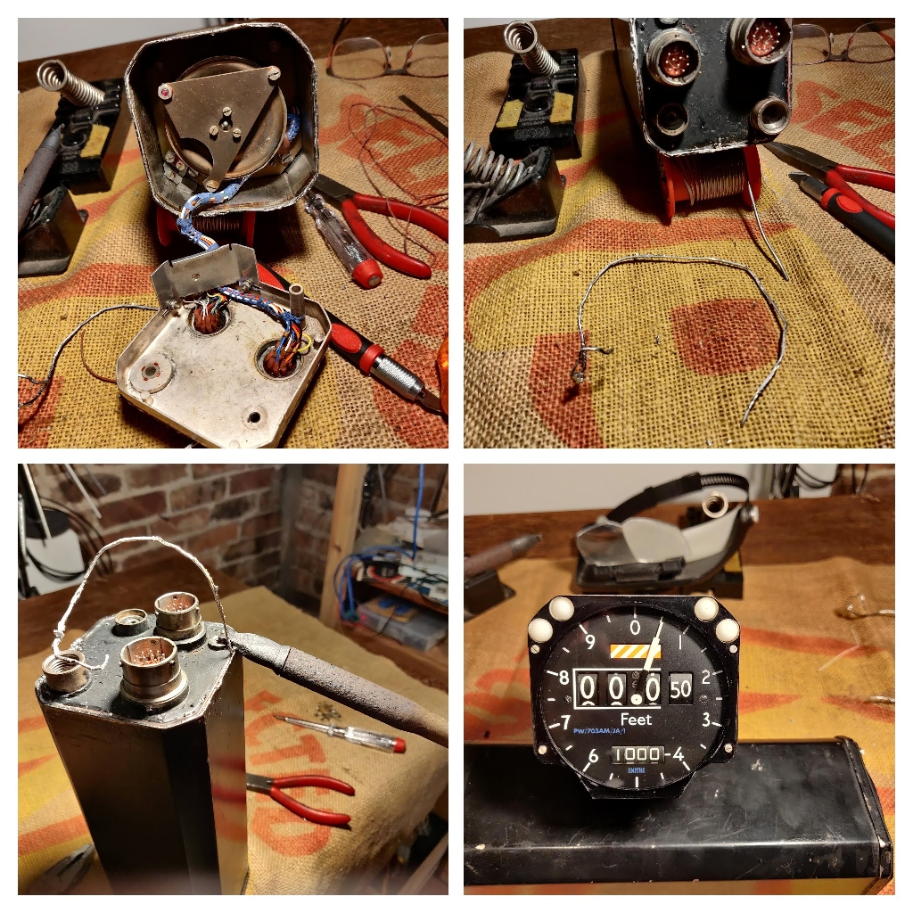
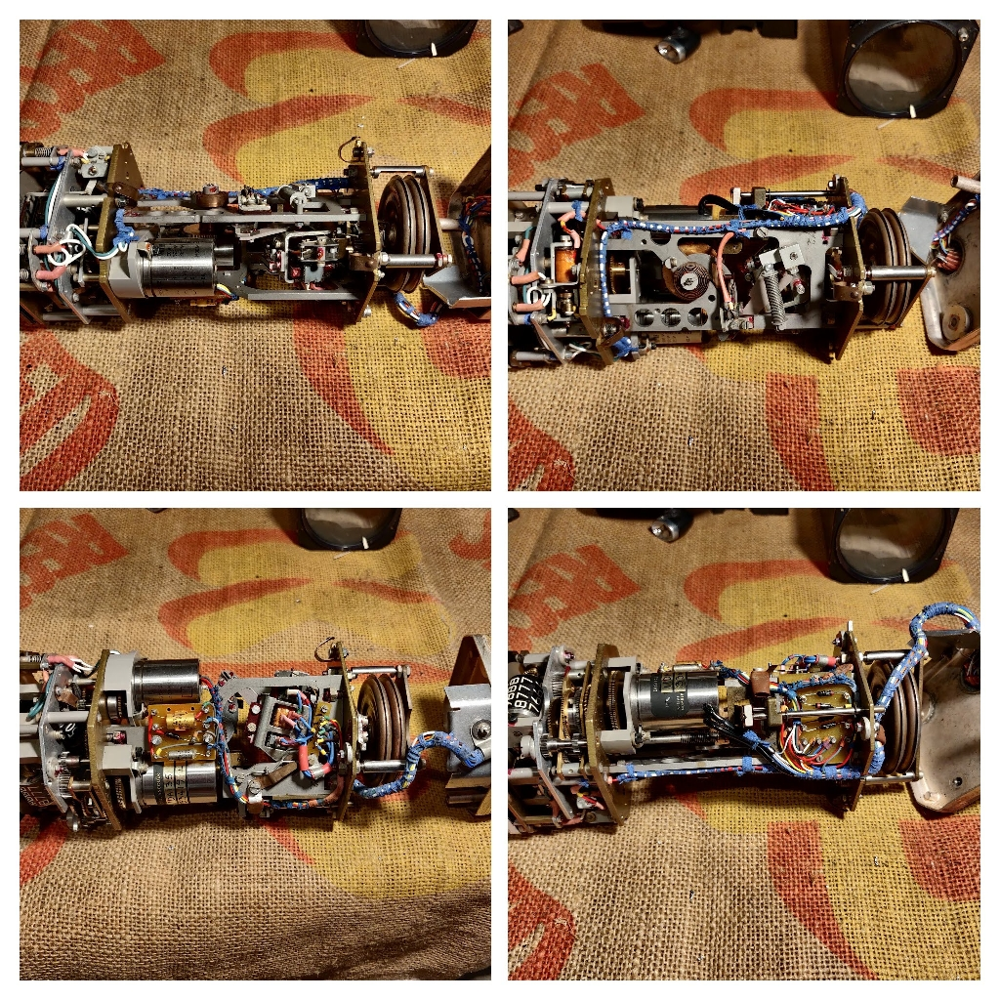

# Altimeter_Encoder

Investigation of Smiths Altimeter

## Markings

* Range -1000 to +60000 Ft
* Code PW/703AM/JA/1
* SER.No AA6481
* SMITHS INDUSTRIES LIMITED
* MADE IN CHELTENHAM, ENGLAND

 

 

## Altimeter related documents

[ServoAltAmplifier](/home/david/Github/Aviation_Altimeter_Encoder/documents/ServoAltAmplifier.pdf)

[ServoAltimeter](/home/david/Github/Aviation_Altimeter_Encoder/documents/ServoAltimeter.pdf)

[gillham-code-reference](/home/david/Github/Aviation_Altimeter_Encoder/documents/transponder-gray-code-gillham-code-reference.pdf)

## Gillham encoder references

* standard pressure for calibration is 1013.25 mb

When altimeter setting is 1013 then altimeter and encoder values conincide.

[code reference](https://support.michiganavionics.com/portal/en/kb/articles/transponder-gray-code-gillham-code-reference) pdf table download available here

[online conversion tool](https://www.avionictools.com/graycalc.php) online value conversion to/from Gillham/Altitude

[PIC decoder](https://drive.google.com/drive/folders/0B6ytVYfsfAiNNzE0Njk3ZTItODMxYS00NThlLTk4ZGEtOWE5Y2E1OTRhYjk1) PIC decoder by Kevin Stewart

### Gillham encoder output

| Bit #|Max   |Pin -#|
|------|------|----- |
| C4   |-1200 |  9   |
| C2   |-1000 |  4   |
| C1   |-800  |  3   |
| B4   |-300  |  2   |
| B2   | 700  |  1   |
| B1   |2700  |  8   |
| A4   |6700  |  7   |
| A2   |14700 |  6   |
| A1   |30700 |  5   |
| D4   |62700 |      |
| D2   |126700|      |
| D1   |  ?   |      |
|Common|      | 15   |

## Pin layout of 15 way encoder output

|  Pin #|     |          |
|-------|-----|----------|
| 1     |     | B2       |
| 2     |     | B4       |
| 3     |     | C1       |
| 4     |     | C2       |
| 5     |     | A1       |
| 6     |     | A2       |
| 7     |     | A4       |
| 8     |     | B1       |
| 9     |     | C4       |
|10     |     | D4?      |
|11     |     | n/c      |
|12     |     | D2?      |
|13     |     |Enc-ready |
|14     |     |Enc-common|
|15     |     |Chassis   |

## Pin layout of 15 pin system connector

| Pin #| Colour|Function           |
|------|-------|-------------------|
|  1   |       | Servo drive IP ct |
|  2   |       | Sense 3           |
|  3   |       | AC input 26V 400~ |
|  4   |       | AC input common   |
|  5   |       | Servo drive IP a  |
|  6   |       | Servo drive IP b  |
|  7   |       | AC input 115V 400~|
|  8   |       | Limit switch n/c a|
|  9   |       | Limit switch n/c b|
| 10   |       | Sense 2           |
| 11   |       | Chassis           |
| 12   |       | n/c (lamp option) |

## Arduino encoder display

Arduino application to decode Gillham output and show altitude and Gillham values on 7 segmant LED display module, switch to select output format.

| Selection|Feature|
| -------- | ----- |
| Sw3| 8 binary display (8 bits)|
| Sw | 4 digit octal split (12 bits)|
| Default  | Altitude in ft|

[source code](./Altimeter_decoder/Altimeter_decoder.ino)

