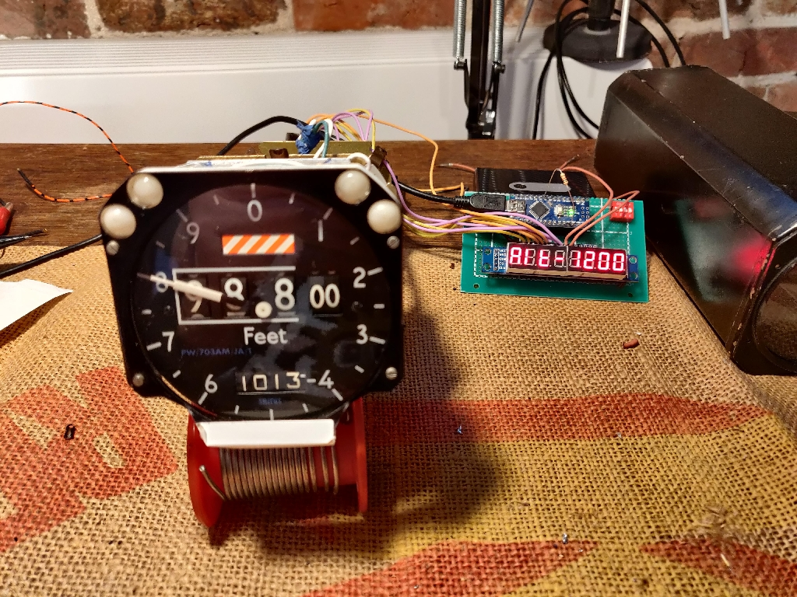

# Altimeter_Encoder

Investigation of Smiths Altimeter

## Markings

* Range -1000 to +60000 Ft
* Code PW/703AM/JA/1
* SER.No AA6481
* SMITHS INDUSTRIES LIMITED
* MADE IN CHELTENHAM, ENGLAND

## Arduino encoder display

[sketch](./Altimeter_decoder/Altimeter_decoder.ino)
